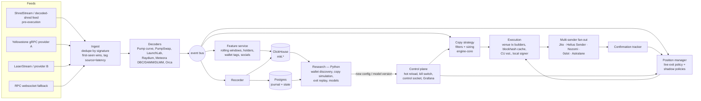

# 02 — Architecture

## Goals, in priority order
1. **Never lose data.** Every leader swap, every decision (including skips), every order, and every post-entry price path is recorded at decision-time fidelity.
2. **Land close to the leader.** Detection → landed transaction within 1–2 slots at p50.
3. **Exits are ours.** The leader's sell is an input event. The exit decision comes from a policy we tune on data.
4. **One code path for live, shadow and replay.** Strategy logic lives in the I/O-free [`engine-core`](../engine/crates/core) crate, so a policy that wins offline behaves the same live.
5. **Grow into a leader-free engine.** The firehose plus feature snapshots should be enough to train entries without any leader.

## System diagram



## Components

### Ingest
- **Multiple redundant feeds:**
  - a shred feed for the earliest view of leader transactions;
  - two Geyser gRPC providers for confirmed data with logs and balances;
  - an RPC websocket as last resort.
- **Dedupe by signature.** The first arrival wins. Record `source` and `observed_at` on every event so per-feed latency is always measurable (`copy_signals.detect_latency_ms`).
- **Subscription scope:**
  - **Leaders:** transactions that mention any active, probation or candidate leader address. This is the copy signal.
  - **Universe:** all transactions on the tracked launchpad and AMM programs. This is the firehose that feeds features, replay and the future leader-free engine. Start with programs relevant to leaders' tokens, then widen.
  - **Accounts:** pool and bonding-curve accounts for tokens we hold. This gives live reserves for pricing and liquidity-drop exits.
- **Shred caveat:** shred-derived transactions are pre-execution, so the leader's transaction may still fail. Act on shreds only for buys and only when the decode is unambiguous. Reconcile against Geyser and log `leader_tx_failed` outcomes.

### Decoders
- **Use Carbon decoders** where they exist. Hand-write minimal decoders for anything missing.
- **Each decoder emits a normalised `SwapEvent`** (see `engine-core::types`), including `tx_index` so we can measure exactly how many pool transactions landed between the leader and us.
- **Aggregator-routed swaps** (Jupiter, OKX): decode the inner venue instruction, keep `via_aggregator`, and price from token balance deltas.
- **Coverage is a tracked metric.** Report the percentage of leader transactions decoded per venue per day. Unknown program IDs go to a "to decode" queue.

### Copy strategy (entry)
- **Pure function** from `engine-core::sizing`: `pre_trade_filters` then `size_buy`.
- **Size** = `copy_pct × leader SOL`, clamped by max buy, the per-position cap, the total exposure cap, the pool-impact cap and free balance.
- **Every outcome is logged** with the reason and the binding cap.
- **Later phase:** a learned entry model (meta-label) multiplies or vetoes the size. Its score and version are logged on every signal.

### Execution
- **Venue-specific transaction builders.** Direct program instructions, not an aggregator, on the hot path. Jupiter Swap API v2 is the fallback for unsupported venues and emergency exits.
- **Hot-path caches:**
  - recent blockhash refreshed every ~400 ms;
  - pre-derived ATAs;
  - address lookup tables;
  - compute-unit limits per venue measured from history, so no per-transaction simulation;
  - a pre-allocated tip and priority-fee schedule.
- **Local in-process signer** for hot wallets (see [06](06-wallets-and-risk.md)).
- **Multi-sender fan-out.** Send the same signed transaction to several landing services. Tip size is a function of signal urgency and the recent landing-rate feedback loop (`orders.landed_by`, `slots_after_leader`).
- **Slippage limit** comes from the expected price impact plus a buffer, not a fixed 50%. Wide slippage on public paths invites sandwiches. Use MEV-protected senders (Jito bundles, Astralane-style private relay) for buys.
- **Close token accounts after full exits** to reclaim ATA rent (~0.002 SOL per token, which matters at our sizes).

### Position manager (exit)
- **One `PositionState` per open position** plus the live `ExitPolicy`, from `engine-core::exit`.
- **Inputs:** pool trades (price), leader sells, dev sells, liquidity updates, and a 1 s clock tick.
- **Shadow policies.** The same events are fed to every policy in `shadow_exits`, each with its own state. Results go to the `shadow_exits` table.
- **Path recording.** Every pool trade for the token is already in `mkt.swaps`, so any policy can be replayed later with `engine-core::replay`.
- **Sell sizing.** Fractions are always of the *initial* position, and orders retry with escalating tip and slippage on failure.
- **Emergency path.** If a sell keeps failing, for example on a frozen or honeypot token, escalate, alert, and mark the position `stuck`.

### Feature service
- Maintains rolling per-token state from the firehose: flow windows, unique traders, transactions per second, returns and volatility. Plus:
  - **holders:** DAS snapshot on first touch, then incremental from swaps and transfers;
  - **wallet tags:** from our wallet-intelligence tables;
  - **dev history;**
  - **socials:** metadata URI → links; selective X API calls.
- **Writes `mkt.token_snapshots`** on a cadence (e.g. every 5 s for held tokens, every 60 s for the universe) and **at every decision point** (leader buy, our entry, our exit).
- **Point-in-time correctness.** A snapshot contains only information available at its timestamp. Every model will be trained on these, so lookahead here silently poisons everything.

### Recorder
- Batched inserts into ClickHouse for market data and Postgres for the journal.
- Must never block the hot path: lock-free channel, drop-to-disk spill on backpressure, replay on restart.

### Control plane
- **Config hot reload,** validated by `EngineConfig::validate` before swap-in.
- **Kill switch** triggers:
  - daily loss limit;
  - a feed stale for more than N seconds;
  - sender landing-rate collapse;
  - a balance discrepancy;
  - a manual command.
- **Local control socket** (`copybot ctl`): status, positions, pause, resume, kill, flatten. No external messaging service.
- **Grafana** on ClickHouse/Postgres for dashboards: PnL, latency histograms, landing rates, per-leader copy returns, shadow-policy leaderboard.

### Research (offline, Python)
- **Stack:** polars / duckdb / clickhouse-connect, plus lightgbm, scikit-survival or lifelines, and optuna.
- **Jobs:** wallet discovery and scoring with copy simulation ([04](04-wallet-selection.md)), exit tuning and model training ([05](05-exit-engine.md)).
- **Outputs:** versioned configs and models that go through the promotion gates.

## Latency budget (targets to measure, not guarantees)

| Step | Target |
|---|---|
| Leader transaction → our receipt (shred feed) | Before the leader's slot completes |
| Leader transaction → our receipt (Geyser, processed) | 10–40 ms after execution |
| Decode + filters + sizing | < 1 ms |
| Build + sign (cached blockhash, local key) | < 1 ms |
| Fan-out send → block engine / leader | ~5–50 ms, colocated |
| **Land** | **leader_slot + 1 (p50), ≤ +2 (p90)** |

Host the engine in the same region as the providers' gRPC and sender endpoints. Pick the region by measuring: run the shadow engine in two regions for a week and compare `detect_latency_ms` and `slots_after_leader`.

## Technology choices
| Concern | Choice | Why |
|---|---|---|
| Hot path | **Rust** (tokio) | Predictable latency; Carbon and Yellowstone clients are Rust-native; Solana SDKs are first-class |
| Strategy logic | `engine-core` crate (pure Rust) | Same code for live, shadow, replay; unit-tested |
| Market store | **ClickHouse** | Billions of swap rows, fast window aggregations, cheap compression |
| Journal / state | **Postgres** | Transactions, constraints, joins for reporting |
| Research | **Python** | Ecosystem for modelling; reads ClickHouse directly |
| Dashboards | **Grafana** | Native ClickHouse and Postgres sources |
| Control | Unix socket + `copybot ctl` | No third-party dependency in the trading path |

## Repository layout
```
engine/                 Rust workspace (hot path; engine-core today)
  crates/core/          pure domain logic: types, config, sizing, exit, replay, wallet_score
config/                 engine.example.toml (validated by tests)
schema/clickhouse/      market firehose + feature snapshots
schema/postgres/        journal: leaders, signals, positions, orders, shadow exits, wallets
docs/                   research and design (this folder)
tools/dashboards/       standalone HTML dashboards (cross-asset meme basket)
archive/                unrelated legacy code (RFO BASIC Android app)
```

Planned crates: `ingest`, `decoders`, `exec`, `positions`, `features`, `recorder`, and `bin/engine`. Planned folder: `research/`, a Python package.
